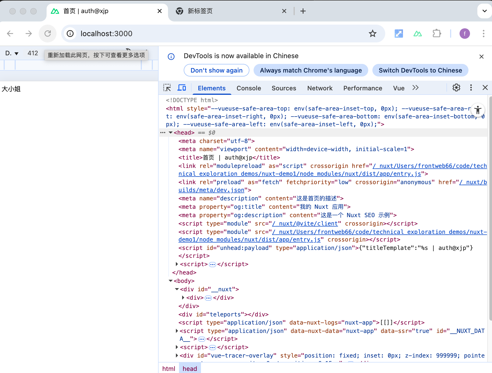

## 参考文档
- [Nuxt SEO 指南](https://nuxt.com/docs/getting-started/seo-meta)
- [Nuxt SEO 指南](https://nuxt.com/docs/getting-started/seo-meta)
- [MDN: Meta 标签](https://developer.mozilla.org/zh-CN/docs/Web/HTML/Element/meta)
- [Open Graph protocol](https://ogp.me/)
- [Google 搜索中心：SEO 入门指南](https://developers.google.com/search/docs/fundamentals/seo-starter-guide?hl=zh-cn)

# Nuxt 配置项详解：从 `app.head` 开始

## 目录导航
- [1. `defineNuxtConfig` 基本用法](#1-defineNuxtConfig-基本用法)
- [2. `app.head` 配置](#2-apphead-配置)
  - [2.1 占位符（如 `%s`）](#21-占位符如-s)
  - [2.2 `titleTemplate` 详解](#22-titleTemplate-详解)
  - [2.3 `meta` 标签配置](#23-meta-标签配置)
- [3. 页面级别的 `useHead` 用法](#3-页面级别的-useHead-用法)
- [4. `$占位符` 使用](#4-占位符-使用)

[返回顶部](#nuxt-配置项详解从-apphead-开始)

---

## 1. `defineNuxtConfig` 基本用法 <a id="1-defineNuxtConfig-基本用法"></a>

`defineNuxtConfig` 是 Nuxt 3 用于导出项目配置的函数。你可以在 `nuxt.config.ts` 文件中这样使用：

```ts
// nuxt.config.ts
export default defineNuxtConfig({
    // 这里填写你的 Nuxt 配置
})
```

[返回顶部](#nuxt-配置项详解从-apphead-开始)

---

## 2. `app.head` 配置 <a id="2-apphead-配置"></a>

`app.head` 用于设置全局的 HTML `<head>` 内容，比如标题、描述、关键字等。

```ts
export default defineNuxtConfig({
    app: {
        head: {
            title: '我的 Nuxt 应用', // 默认标题
            titleTemplate: '%s - 我的 Nuxt 应用', // 标题模板
            meta: [
                { name: 'description', content: '这是我的 Nuxt 应用的描述' },
                { name: 'keywords', content: 'nuxt, vue, 前端' }
            ]
        }
    }
})
```

### 2.1 占位符（如 `%s`） <a id="21-占位符如-s"></a>

在 `titleTemplate` 中，`%s` 是一个占位符，会被当前页面的标题替换。

```ts
titleTemplate: '%s | 公司名称'
```
- 页面无标题时：`默认标题 | 公司名称`
- 页面设置标题时：`页面标题 | 公司名称`

[返回顶部](#nuxt-配置项详解从-apphead-开始)

### 2.2 `titleTemplate` 详解 <a id="22-titleTemplate-详解"></a>

用于统一网站标题风格，支持动态替换：

```ts
titleTemplate: (title) => title ? `${title} - 站点后缀` : '默认标题'
```

[返回顶部](#nuxt-配置项详解从-apphead-开始)

### 2.3 `meta` 标签配置 <a id="23-meta-标签配置"></a>

常用SEO配置示例：

```ts
meta: [
    { charset: 'utf-8' },
    { name: 'viewport', content: 'width=device-width, initial-scale=1' },
    { hid: 'description', name: 'description', content: '页面描述' }
]
```

[返回顶部](#nuxt-配置项详解从-apphead-开始)

---

## 3. 页面级别的 `useHead` 用法 <a id="3-页面级别的-useHead-用法"></a>

页面组件中覆盖全局配置：

```vue
<script setup>
useHead({
    title: '产品详情',
    meta: [
        { name: 'description', content: '产品详细描述' },
        { property: 'og:image', content: '/product.jpg' }
    ],
    link: [
        { rel: 'canonical', href: 'https://example.com/product' }
    ]
})
</script>
```

[返回顶部](#nuxt-配置项详解从-apphead-开始)

---

## 4. `$占位符` 使用 <a id="4-占位符-使用"></a>

动态插入运行时数据：

```ts
useHead({
    titleTemplate: '%s - $runtimeConfig.appName'
})
```

预览效果：


[返回顶部](#nuxt-配置项详解从-apphead-开始)