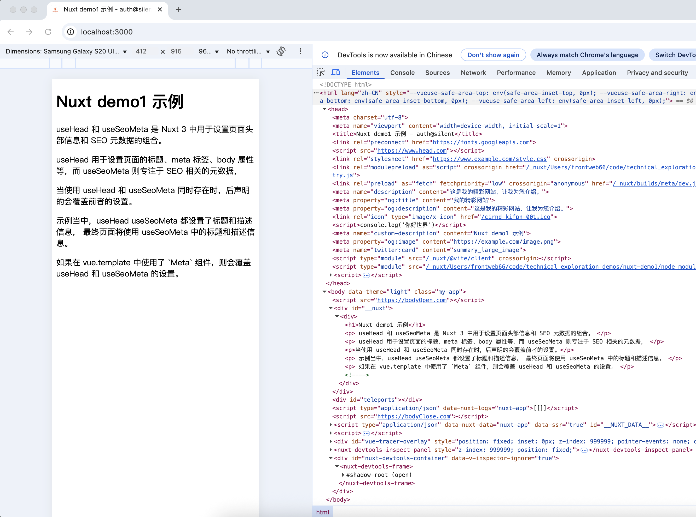

# Nuxt SEO 与 Meta 配置指南

[[TOC]]

## 概述

Nuxt 提供了强大的 head 配置、组合式函数和组件来优化应用的 SEO。通过 Unhead 实现的 head 标签管理系统，Nuxt 提供了合理的默认值、多种组合式函数和丰富的配置选项。

[➡️ 下一章：基础配置](#基础配置)

## 基础配置

### nuxt.config.ts 配置

在 `nuxt.config.ts` 中配置 `app.head` 可以为整个应用静态设置 head 内容。这种方式不支持响应式数据，适合设置不会变化的标签，如默认标题、语言和 favicon。

```typescript
export default defineNuxtConfig({
  app: {
    head: {
      title: 'Nuxt', // 默认标题
      htmlAttrs: {
        lang: 'zh-CN', // 语言设置为中文
      },
      link: [
        { rel: 'icon', type: 'image/x-icon', href: '/favicon.ico' },
      ]
    }
  }
})
```

[⬆️ 返回目录](#概述) | [➡️ 下一节：默认标签](#默认标签)

### 默认标签

Nuxt 提供了一些默认标签确保网站良好运行：

- `viewport`: `width=device-width, initial-scale=1`
- `charset`: `utf-8`

如需覆盖这些默认值：

```typescript
export default defineNuxtConfig({
  app: {
    head: {
      charset: 'utf-16',
      viewport: 'width=device-width, initial-scale=1, maximum-scale=1',
    }
  }
})
```

[⬆️ 返回目录](#概述) | [⬅️ 上一节：nuxt.config.ts 配置](#nuxt.config.ts-配置) | [➡️ 下一章：组合式函数](#组合式函数)

## 组合式函数

### useHead

`useHead` 组合式函数支持响应式输入，可以编程式管理 head 标签。

```vue
<script setup lang="ts">
useHead({
  title: '我的应用',
  meta: [
    { name: 'description', content: '我的精彩网站。' }
  ],
  bodyAttrs: {
    class: 'test'
  },
  script: [ { innerHTML: 'console.log(\'你好世界\')' } ]
})
</script>
```

[⬆️ 返回目录](#概述) | [➡️ 下一节：useSeoMeta](#useSeoMeta)

### useSeoMeta

`useSeoMeta` 组合式函数提供了类型安全的 SEO meta 标签定义方式，避免拼写错误。

```vue
<script setup lang="ts">
useSeoMeta({
  title: '我的精彩网站',
  ogTitle: '我的精彩网站',
  description: '这是我的精彩网站，让我为您介绍。',
  ogDescription: '这是我的精彩网站，让我为您介绍。',
  ogImage: 'https://example.com/image.png',
  twitterCard: 'summary_large_image',
})
</script>
```

[⬆️ 返回目录](#概述) | [⬅️ 上一节：useHead](#useHead) | [➡️ 下一章：组件方式](#组件方式)

## 组件方式

Nuxt 提供了以下组件来定义 head 标签：`<Title>`, `<Base>`, `<NoScript>`, `<Style>`, `<Meta>`, `<Link>`, `<Body>`, `<Html>` 和 `<Head>`。

```vue
<script setup lang="ts">
const title = ref('你好世界')
</script>

<template>
  <div>
    <Head>
      <Title>{{ title }}</Title>
      <Meta name="description" :content="title" />
      <Style>
      body { background-color: green; }
      </Style>
    </Head>

    <h1>{{ title }}</h1>
  </div>
</template>
```
注意，如果使用组件的方式来定义head标签，他的优先级比较高，会覆盖 `useHead` 、`useSeoMeta`


[⬆️ 返回目录](#概述) | [➡️ 下一章：高级特性](#高级特性)

## 高级特性

### 响应式支持

所有属性都支持响应式，可以通过计算值、getter 或响应式对象实现。

```vue
<script setup lang="ts">
const description = ref('我的精彩网站。')

useHead({
  meta: [
    { name: 'description', content: description }
  ],
})
</script>
```

[⬆️ 返回目录](#概述) | [➡️ 下一节：标题模板](#标题模板)

### 标题模板

使用 `titleTemplate` 可以自定义网站标题格式：

```vue
<script setup lang="ts">
useHead({
  titleTemplate: (titleChunk) => {
    return titleChunk ? `${titleChunk} - 网站标题` : '网站标题';
  }
})
</script>
```

他其实和 `$s` 占位符是同样的效果。不同的是，`titleTemplate` 如果是函数，可以执行更复杂的逻辑。

[⬆️ 返回目录](#概述) | [⬅️ 上一节：响应式支持](#响应式支持) | [➡️ 下一节：模板参数](#模板参数)

### 模板参数

[templateParams详解](tempate-params.md)

使用 `templateParams` 可以在标题模板中添加额外占位符：

```vue
<script setup lang="ts">
useHead({
  templateParams: {
    siteName: '网站标题',
    separator: '-'
  }
  titleTemplate: (titleChunk) => {
    return titleChunk ? `${titleChunk} %separator %siteName` : '%siteName';
  },
  
})
</script>
```
`templateParams` 中实际上有一个隐匿的字段 `title`, 他就是 `%s`


[⬆️ 返回目录](#概述) | [⬅️ 上一节：标题模板](#标题模板) | [➡️ 下一节：Body 标签](#Body-标签)

### Body 标签

使用 `tagPosition: 'bodyClose'` 可以将标签添加到 `<body>` 末尾：

```vue
<script setup lang="ts">
useHead({
  script: [
    {
      src: 'https://third-party-script.com',
      tagPosition: 'bodyClose' // 可选值: 'head' | 'bodyClose' | 'bodyOpen'
    }
  ]
})
</script>
```

[⬆️ 返回目录](#概述) | [⬅️ 上一节：模板参数](#模板参数) | [➡️ 下一章：实用示例](#实用示例)

## 实用示例

### 结合 definePageMeta 使用

在页面组件中设置元数据：

```vue
<script setup lang="ts">
definePageMeta({
  title: '某个页面'
})
</script>
```

在布局中使用路由元数据：

```vue
<script setup lang="ts">
const route = useRoute()

useHead({
  meta: [{ property: 'og:title', content: `应用名称 - ${route.meta.title}` }]
})
</script>
```

[⬆️ 返回目录](#概述) | [➡️ 下一节：动态标题](#动态标题)

### 动态标题

设置动态页面标题：

```vue
<script setup lang="ts">
useHead({
  titleTemplate: '%s - 网站标题'
})
</script>
```

或者使用函数形式：

```vue
<script setup lang="ts">
useHead({
  titleTemplate: (productCategory) => {
    return productCategory
      ? `${productCategory} - 网站标题`
      : '网站标题'
  }
})
</script>
```

[⬆️ 返回目录](#概述) | [⬅️ 上一节：结合 definePageMeta 使用](#结合-definePageMeta-使用) | [➡️ 下一节：外部 CSS](#外部-CSS)

### 外部 CSS

加载 Google 字体：

```vue
<script setup lang="ts">
useHead({
  link: [
    {
      rel: 'preconnect',
      href: 'https://fonts.googleapis.com'
    },
    {
      rel: 'stylesheet',
      href: 'https://fonts.googleapis.com/css2?family=Roboto&display=swap',
      crossorigin: ''
    }
  ]
})
</script>
```

[⬆️ 返回目录](#概述) | [⬅️ 上一节：动态标题](#动态标题) | [➡️ 下一节：完整示例](#完整示例)

### 完整示例

#### 示例完整 nuxt.config.ts
```ts
// https://nuxt.com/docs/api/configuration/nuxt-config
export default defineNuxtConfig({
    compatibilityDate: "2025-05-15",
    devtools: { enabled: true },
    app: {
        head: {
            // charset viewport 有默认设置。
            // charset: 'utf-8', 
            // viewport: 'width=device-width, initial-scale=1, maximum-scale=1',
            title: "demo",
            titleTemplate: "%s | auth@xjp",
            htmlAttrs: {
                lang: 'zh-CN', // 语言设置为中文
            },
            link: [
                { rel: 'icon', type: 'image/x-icon', href: '/cirnd-kifpn-001.ico' },
            ],
            meta: [
                { name: "description", content: "这是一个 Nuxt SEO 示例" },
                { property: "og:title", content: "我的 Nuxt 应用" },
                { property: "og:description", content: "这是一个 Nuxt SEO 示例" },
            ],
        },
    },
});
```

#### app.vue 完整代码。

```vue
<template>
  <div>
    <h1>{{ title }}</h1>
    <p>
      useHead 和 useSeoMeta 是 Nuxt 3 中用于设置页面头部信息和 SEO
      元数据的组合。
    </p>

    <p>
      useHead 用于设置页面的标题、meta 标签、body 属性等，而 useSeoMeta 则专注于
      SEO 相关的元数据，
    </p>

    <p>当使用 useHead 和 useSeoMeta 同时存在时，后声明的会覆盖前者的设置。</p>
    <p>
      示例当中，useHead useSeoMeta 都设置了标题和描述信息， 最终页面将使用
      useSeoMeta 中的标题和描述信息。
    </p>
    <p>
        如果在 vue.template 中使用了 `Meta` 组件，则会覆盖 useHead 和 useSeoMeta 的设置。
    </p>
          <Meta name="custom-description" :content="title" />

  </div>
</template>

<script setup>
import { ref } from "vue";
const route = useRoute()
const title = ref("Nuxt demo1 示例");
useHead({
  title: "首页", // 当前页面标题
  meta: [{ name: "description", content: "这是首页的描述" }],
  bodyAttrs: {
    // body 标签的属性
    "data-theme": "light", // 设置主题
    class: "my-app",
  },
  script: [
    { innerHTML: "console.log('你好世界')" },// 页面内联脚本
   
    { src: 'https://www.head.com', tagPosition: 'head'}, // 在head标签中添加脚本
    { src: 'https://bodyClose.com', tagPosition: 'bodyClose'}, // 在body标签的末尾添加脚本
    { src: 'https://bodyOpen.com', tagPosition: 'bodyOpen'}, // 在body标签的开头添加脚本
  ],
  link: [
    {
      rel: 'preconnect',
      href: 'https://fonts.googleapis.com'
    },
    {
      rel: 'stylesheet',
      href: 'https://www.example.com/style.css',
      crossorigin: ''
    }
  ]
});

useSeoMeta({
  title: title.value,
  titleTemplate: (titleChunk) => {
    return titleChunk ? `${titleChunk} - auth@silent` : "nuxt3-demo";
  },
  ogTitle: "我的精彩网站",
 
  description: "这是我的精彩网站，让我为您介绍。",
  customDescription: "他会被 Meta 组件覆盖", // 这个会被 Meta 组件覆盖
  ogDescription: "这是我的精彩网站，让我为您介绍。",
  ogImage: "https://example.com/image.png",
  twitterCard: "summary_large_image",
});
</script>
```

[⬆️ 返回目录](#概述) | [⬅️ 上一节：外部 CSS](#外部-CSS)

